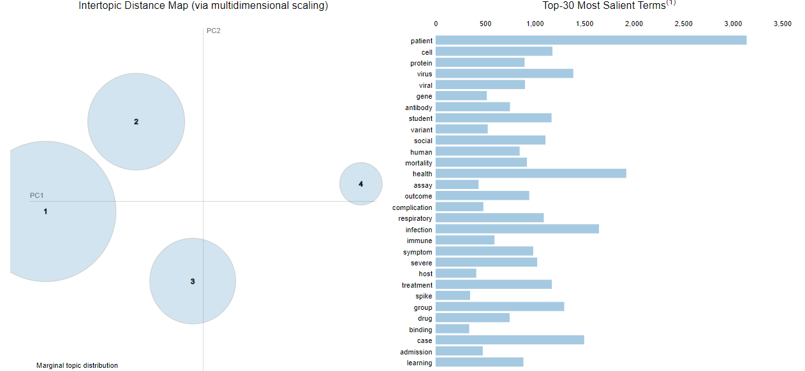

# COVID-19 Open Research Dataset Challenge (CORD-19)

This project is competition in Kaggle [COVID-19 Open Research Dataset Challenge (CORD-19)](https://www.kaggle.com/datasets/allen-institute-for-ai/CORD-19-research-challenge)  

Covid 19             |  Topic modeling
:-------------------------:|:-------------------------:
  |  

#### -- Project Status: [Completed]

## Project Intro/Objective
The purpose of the analysis is to gain a deeper understanding of the CORD-19 dataset, which contains scholarly articles related to COVID-19, and to extract meaningful insights from the data using text mining techniques. The analysis serves several objectives:

* *Data Exploration and Preprocessing:* The purpose is to explore the dataset and analyze its distribution, including articles, authors, publication dates, and other relevant factors. This helps in understanding the characteristics and trends within the dataset.

* *Text Mining and Insights Generation:* The goal is to select appropriate text mining techniques, such as AI and NLP, to extract insights from the textual data. By addressing the research goal of identifying risk factors of COVID-19, the analysis formulates relevant queries and applies text mining tools to analyze the articles. The aim is to identify potential risk factors associated with COVID-19 and uncover insights and patterns from the data.

* *Research Questions and Key Topics:* The analysis explores the key scientific topics provided in the dataset and selects specific research questions suitable for text mining and analysis. By developing models or algorithms, the analysis aids in the identification of topics from the CORD-19 dataset. The accuracy and reliability of the topics identified are evaluated using appropriate metrics.

* *Reporting and Insights:* The purpose is to document and present the findings of the analysis in a clear and organized manner. This includes documenting the identified topics and their significance in the context of COVID-19. Visualizations, summarizations, and relevant materials are provided to effectively convey the extracted insights. The analysis aims to provide valuable information for researchers, policymakers, and the broader community to enhance the understanding and response to COVID-19.

### Methods Used
* Data Quality (missingno, pandas)
* Natural Language Processing (NLP)
* Topic modeling
* Data Visualization (matplotlib, seaborn)

### Technologies
* Python
    * Natural Language Processing (NLP)
        * gensim - corpora, models 
        * nltk -corpus, stem (WordNetLemmatizer), tokenize
        * spacy - Strength Natural Language Processing
    * Topic modeling: 
        * pyLDAvis: 

## Project Description
The COVID-19 Open Research Dataset (CORD-19) was created by the White House and research groups to support the global research community in their fight against COVID-19. With over 1,000,000 scholarly articles, including 400,000 with full text, CORD-19 provides a valuable resource for applying advancements in natural language processing and AI techniques. This project aims to explore and preprocess the dataset, mine insights, identify COVID-19 risk factors, and analyze key scientific topics. By leveraging AI and NLP, the project seeks to generate new insights to combat the rapid acceleration of COVID-19 literature and contribute to the ongoing fight against the pandemic.

## Needs of this project
The project addresses several needs in the context of the COVID-19 pandemic:

* Knowledge Expansion: The project aims to expand the knowledge base by exploring and analyzing the vast CORD-19 dataset. By extracting insights and identifying risk factors, the project contributes to the understanding of COVID-19 and related coronaviruses.

* Research Support: The project provides valuable resources and tools for the global research community. By applying advanced techniques in natural language processing and AI, it assists researchers in generating new insights and staying up-to-date with the rapidly evolving COVID-19 literature.

* Decision Making: The project's findings and insights can inform decision-making processes for various stakeholders, including policymakers, healthcare professionals, and public health officials. By identifying risk factors and key topics, the project helps in formulating evidence-based strategies and interventions to mitigate the impact of the pandemic.

* Collaboration and Efficiency: The freely available CORD-19 dataset and the project's methodologies promote collaboration among researchers and institutions. By sharing research findings, visualizations, and code snippets, the project encourages the exchange of knowledge and accelerates research efforts.

## Getting Started

This project does not require any specific setup for exploration. It has been developed using Jupyter notebook, and all the code is readily accessible. You can easily navigate through the project and explore the code in the Jupyter notebook environment.

## Featured Notebooks/Analysis/Deliverables
You can access to the code 
* [Main notebook](/notebooks)  

The data was extracted from the [Kaggle competition page](https://www.kaggle.com/datasets/allen-institute-for-ai/CORD-19-research-challenge).

### Methodology Overview

The methodology developed for this project on GitHub involved several steps to analyze the CORD-19 dataset and extract meaningful insights. The key steps were as follows:

1. **Data Quality Check:**
   - Conducted a thorough analysis of the dataset to identify and handle missing values, ensuring data quality and reliability.

2. **Exploratory Data Analysis:**
   - Performed exploratory data analysis to gain a deeper understanding of the dataset's characteristics, distribution, and patterns.

3. **Textual Data Preprocessing:**
   - Preprocessed the textual data using techniques such as tokenization, stop-word removal, and stemming to prepare it for further analysis.

4. **Text Mining Techniques Selection:**
   - Selected appropriate text mining techniques to extract insights from the CORD-19 dataset effectively.
  
5. **Identification of COVID-19 Risk Factors:**
   - Addressed the research goal of identifying risk factors associated with COVID-19.
   - Formulated relevant queries or search criteria to extract information related to risk factors specifically.

6. **Applied Text Mining Tools:**
   - Utilized text mining tools and algorithms to analyze the articles and identify potential risk factors associated with COVID-19.
   - Provided insights and patterns discovered during the analysis to enhance understanding.

7. **Research Question Selection:**
   - Chose specific research questions that were suitable for text mining and analysis.
   - Explained the selection process for these questions and discussed the significance of the chosen topics.

8. **Model Development:**
   - Developed models or algorithms that aided in the identification of topics from the CORD-19 dataset.
   - Used these models to enhance topic identification and analysis.

9. **Performance Evaluation:**
   - Evaluated the performance of the models using appropriate metrics to assess their accuracy and reliability.
   - Discussed the results and insights derived from the identified topics.

